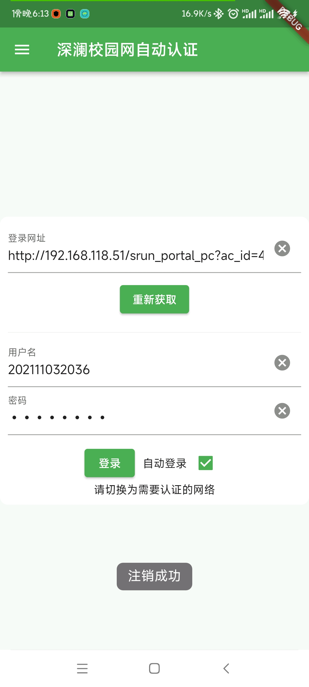

# 📱 Auto_Srun

本项目是一个基于 Flutter 开发的自动进行深澜网络认证的软件。可以帮助学生、教师等用户快速、方便地完成深澜认证，无需手动输入账号和密码。

## ✨ 仓库
- [GitHub](https://github.com/ltxhhz/auto_srun)
- [Gitee(码云)](https://gitee.com/ltxhhz/auto_srun) 仅作为镜像使用，不接受 issue & pr

## 🚀 开始使用

- 前往[github](https://github.com/ltxhhz/auto_srun/release)/[gitee](https://gitee.com/ltxhhz/auto_srun/release) release下载最新版本安装。
- 软件内，先将认证的网址填入后进行获取配置，获取成功后才可登录。
- 如不放心可自行构建。

## ❤️ 参与开发

- 当前软件逻辑只对我自己的学校网络环境进行了适配，如有好的想法欢迎 issue & pr。
- 作者即将毕业，随缘更新。
- 本项目是为了学习 flutter 才做的，所以没有考虑使用其他方式实现会不会更方便。
- 本项目理论上支持全端，但是目前只编译了安卓端，欢迎参与。

### 前置条件

- Flutter 环境：请确保已经安装 Flutter 开发环境，并正确配置了 Flutter SDK 和相关依赖。

### 安装步骤

1. 克隆本项目到本地：

   ```bash
   git clone https://github.com/ltxhhz/auto_srun.git
   ```

2. 进入项目根目录执行以下命令：

   ```bash
   flutter pub get
   ```

3. 运行项目：

   ```bash
   flutter run
   ```

## ⚙️ 功能列表

- 自动获取网络配置。
- 自动完成深澜认证，无需手动操作。
- 支持记住账号和密码，下次启动应用时无需再次输入。

## 📺 界面预览




<!-- ## 🤝 贡献者

- 张三（xxxxxx@qq.com）
- 李四（xxxxxx@qq.com） -->

## 📝 版权声明

本项目基于 MIT 协议开源，请自由地使用、分享和修改代码，但请务必保留作者信息和版权声明。如有任何问题和建议，欢迎联系作者。

## 📬 联系作者

- 邮箱：[ltxhhz@qq.com](mailto:ltxhhz@qq.com)